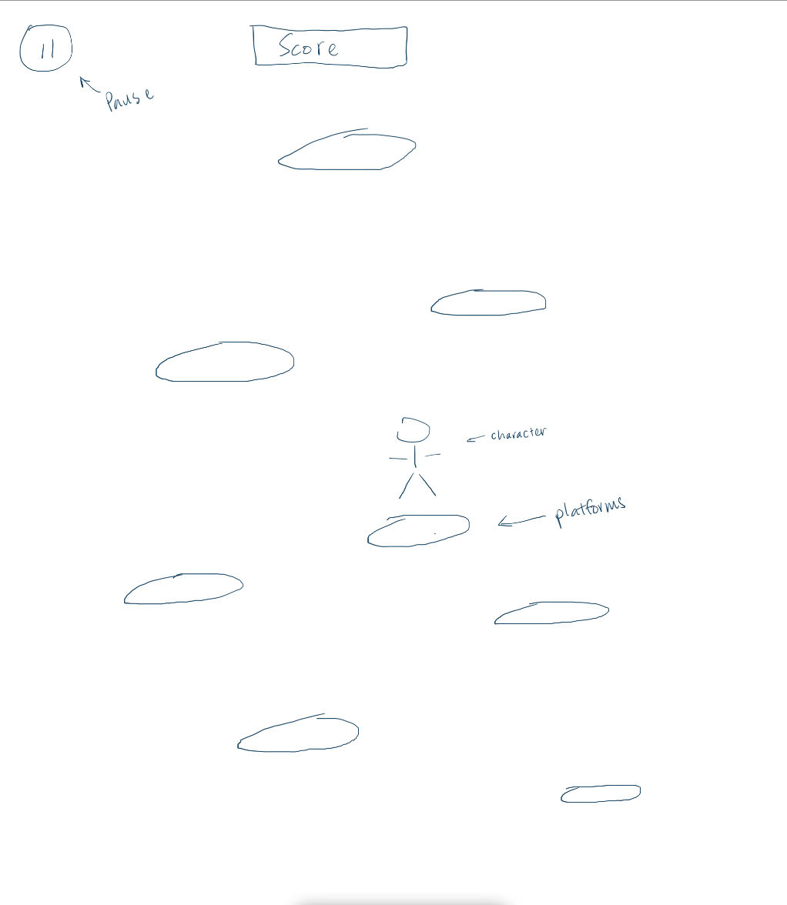
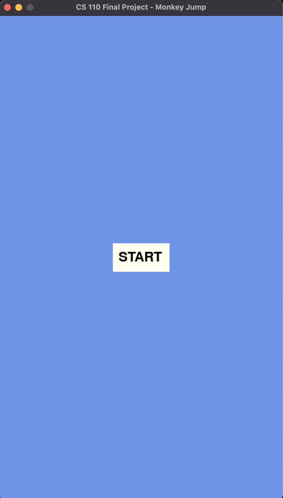
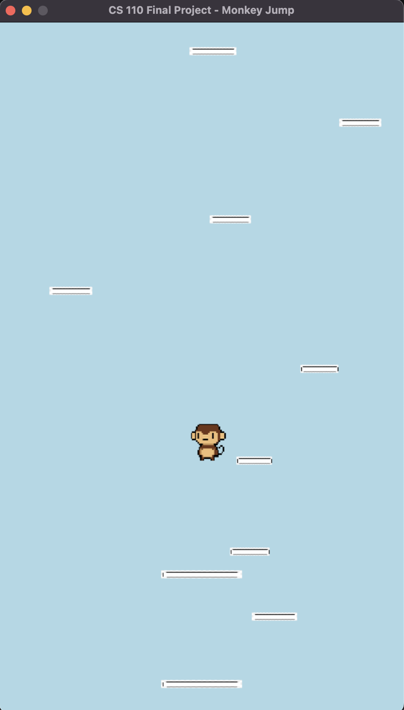
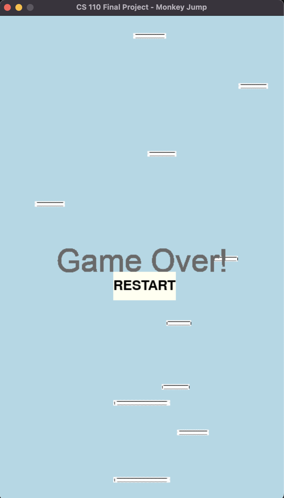

# Monkey Jump
## CS110 Final Project Fall, 2023

## Team Members

Anthony Parisi and Eric Hom

***

## Project Description

Our game is going to be a recreation of the game doodle jump. The character (Monkey) will be constantly jumping and will be able to move to the left or to the right to get to the next platforms to jump on. The player will also be able to wrap, for example, if it goes off the screen to the right it will appear again coming from the left. We have also added a start screen and a game over condition.

***    

## GUI Design

### Initial Design

### Final Design

## Program Design

### Features

1. Start menu
2. Moveable character
3. Object collisions
4. scrolling background
5. Game over screen

### Classes

### Character class
This class initialized the character sprite model. This class also handles the jumping mechanics of the model and wrap around feature. It also returns information that makes the vertical scrolling possible.

### Platforms class
This class initializes the platform sprite model. It also uses the scrolling of the screen to update the positions of the platforms on screen.

## ATP

### Test Case 1: Player movement
- Description: make sure that the character moves to the left and to the right when the correct keys are pressed.
> **Steps:**
> 1. start the game.
> 2. Press the A key.
> 3. Verify that the player's spaceship moves left.
> 4. Press the D key.
> 5. Verify that the player's spaceship moves right.
- Expected Outcome: The character should move left and right when directed by the key pressed.

### Test Case 2: Platform Collision
- Description: make sure that when the player lands on a platform, the game recognizes it and keeps the player on the platform.
> **Steps:**
> 1. start the game.
> 2. Navigate the player to land on a platform.
> 3. Verify that the player collides with the platform.
> 4. Jump and intentionally miss the platforms.
> 5. Verify that the player does not collide with anything.
- Expected Outcome: the character should correctly collide with the platforms.

### Test Case 3: Wrap Around
- Description: make sure that the character wraps around the screen when it leaves from each side.
> **Steps:**
> 1. Start the game.
> 2. Hold the A key so the character moves off screen to the left side.
> 3. Confirm that the character enters from the other side of the screen.
> 4. Hold the D key so the character moves off screen to the right side.
> 5. Confirm that the character enters from the other side of the screen.
- Expected Outcome: The character should appear from the opposite side of the screen that it leaves from.

### Test Case 4: Game Over Condition
- Description: make sure that the game ends when the character falls off of the platforms.
> **Steps:**
> 1. Start the game.
> 2. Play until the character falls off of the platforms.
> 3. Confirm that the game ends and displays a game over screen.
- Expected Outcome: Once the character falls off of the platforms the game should end and display the game over screen.

### Test Case 5: Start Screen
- Description: make sure that before the game starts a start screen is displayed and allows the player to start whenever.
> **Steps:**
> 1. Open the game.
> 2. Press the start button.
> 3. Make sure the game starts when the button is pressed.
- Expected Outcome: Once the start butten is pressed the game should start.